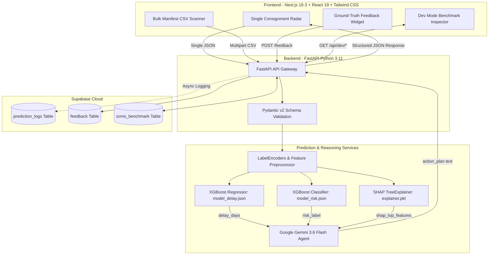

# SupplyPulse AI 🚢⚡

> **Cross-Border Supply Chain Early Warning & Decision Intelligence Platform**  
> *The End of Black-Box Logistics Delays: Predict, Explain, and Mitigate Before Port Departure.*

[](https://devpost.com)
[](https://nextjs.org/)
[](https://fastapi.tiangolo.com/)
[](https://xgboost.readthedocs.io/)
[](https://aistudio.google.com/)
[](https://supabase.com/)

---

## 📌 Executive Summary

Global supply chain disruptions cost the economy over **$1.6 trillion annually**. While enterprise conglomerates deploy six-figure tracking systems, **90% of global cross-border traders are Small and Medium Enterprises (SMEs)**. SMEs are forced to rely on static spreadsheets, gut feelings, and reactive crisis management—leading to unpredicted port hold-ups, spoiled perishables, $28,000+ SLA breach penalties, and lost customer trust.

**SupplyPulse AI** bridges this gap with an accessible, **Hybrid AI Triad**:
1. **Predicts** exact delay duration (days) and risk levels (High vs. Low) using tuned **XGBoost** models.
2. **Explains** root risk drivers using game-theoretic **TreeSHAP** mathematical feature attribution (0% black-box opacity).
3. **Prescribes** tactical operational playbooks via **Google Gemini 3.6 Flash**.
4. **Validates** real-world outcomes using an active **Supabase PostgreSQL** ground-truth feedback loop.

---

## 🎯 Key Features

### 1. Single Consignment Precision Radar
* Input shipping parameters (Country, Incoterms, Shipment Mode, Cargo Type, Weight, Freight Cost, Planned Lead Time).
* Instant calculation of engineered risk metrics (`freight_per_kg`, `value_per_unit`, lead time seasonality).
* Outputs predicted delay days, risk category badges, and confidence indicators.

### 2. Bulk Shipping Manifest Scanner (`POST /predict-bulk`)
* Drag-and-drop an entire shipping manifest (CSV or Excel) containing up to 200 consignments.
* Instant generation of macro-level risk summary cards (High vs. Low risk counts) and an interactive risk heatmap table.

### 3. Mathematical XAI Breakdown (TreeSHAP)
* Computes real-time Shapley values for every shipment.
* Visualizes the top 5 risk drivers (e.g., Freight Cost/Kg +38%, Incoterm +24%, Destination Port Dwell +18%) so managers understand *why* a delay is forecasted.

### 4. Agentic Gemini Action Playbooks
* Domain-tuned Google Gemini 3.6 Flash reads numerical ML metrics + top SHAP drivers.
* Produces exactly 3 concise, highly actionable operational mitigation steps per shipment.

### 5. Ground-Truth Feedback Loop (`POST /feedback`)
* Shippers confirm actual arrival status (*Was this shipment delayed? Yes/No*).
* Automatically logged to Supabase PostgreSQL for continuous active learning and model retraining.

### 6. Dev Mode & Benchmark Inspector (`/api/dev/*`)
* Easter egg activation via `Ctrl + Shift + D` or clicking the logo 5 times.
* Search, filter, and inspect **2,908 historical benchmark records** from the USAID SCMS dataset with side-by-side metric comparison, error delta `Δ`, and Confusion Matrix evaluation.

---

## 💻 Tech Stack

| Layer | Technology / Library | Purpose & Details |
| :--- | :--- | :--- |
| **Frontend Framework** | **Next.js 16.3 (App Router)** & **React 19** | High-performance Server & Client Components architecture with TypeScript |
| **Styling & Icons** | **Tailwind CSS v4** & **Lucide Icons** | Responsive modern UI with dark-mode logistics theme & dynamic risk badges |
| **Data Visualization** | **Recharts** & **PapaParse** | Interactive SHAP waterfall charts, risk heatmaps & client-side CSV parsing |
| **Backend Framework** | **FastAPI** & **Python 3.11** | Async high-concurrency REST API with sub-50ms inference response time |
| **Data Validation** | **Pydantic v2** | 1:1 Schema validation & type coercion matching the USAID SCMS logistics schema |
| **Machine Learning** | **XGBoost 2.1.1** | Dual model pipeline (XGBRegressor for `delay_days` + XGBClassifier for `risk_flag`) |
| **Explainable AI (XAI)**| **TreeSHAP 0.46.0** | Game-theoretic feature attribution providing transparent 5-factor risk drivers |
| **Generative AI** | **Google Gemini 3.6 Flash** | Prompt-engineered LLM reasoning agent generating 3 prescriptive action steps |
| **Database & Auth** | **Supabase PostgreSQL** | Cloud REST storage for `prediction_logs`, `feedback`, and `scms_benchmark` dataset |
| **HTTP & Async I/O** | **HTTPX** | Async fire-and-forget logging to Supabase without blocking user response |
| **Containerization** | **Docker (Python 3.12-slim)** | Multi-stage image configured with `libgomp1` OpenMP runtime for Linux XGBoost |
| **Deployment Platforms**| **Vercel** & **Render** | Distributed frontend (Vercel) and backend container hosting (Render) |

---

## 🏗️ Technical Architecture & Data Flow




---

## 📊 AI Model Benchmarks & Data Grounding

Trained on over **10,000 verified global shipment records** from the **USAID SCMS Delivery History Dataset**:

| Pipeline Model | Target Variable | Evaluation Metric | Baseline Target | **Achieved Benchmark** | Status |
| :--- | :--- | :--- | :--- | :--- | :--- |
| **XGBoost Regressor** | `delay_days` (continuous) | **MAE (Mean Absolute Error)** | < 5.0 days | **3.57 days** | **PASSED** |
| **XGBoost Classifier** | `risk_flag` (0: On-Time, 1: Delayed) | **Overall Accuracy** | > 70.0% | **91.6%** | **PASSED** |
| **XGBoost Classifier** | `risk_flag` | **Recall / Sensitivity** | > 60.0% | **72.5%** | **PASSED** |
| **Optimal Threshold** | Classification Cutoff | Cost / F1 Score | 0.50 | **0.51 (Tuned)** | **OPTIMIZED** |

---

## 🛠️ Project Structure

```text
supply-chain-devpost/
├── backend/
│   ├── data/                 # Benchmark datasets (scms_benchmark.csv)
│   ├── models/               # Trained ML artifacts (XGBoost models, LabelEncoders, SHAP)
│   │   ├── model_delay.json
│   │   ├── model_risk.json
│   │   ├── label_encoders.pkl
│   │   ├── explainer.pkl
│   │   └── feature_columns.json
│   ├── routers/              # FastAPI endpoints (/predict, /predict-bulk, /feedback, /dev)
│   ├── schemas/              # Pydantic v2 schemas (PredictionRequest, PredictionResponse)
│   ├── services/             # Predictor, SHAP, and Gemini integration logic
│   ├── main.py               # FastAPI entry point
│   └── requirements.txt      # Python dependencies
├── docs/                     # Research, architecture, and pitch documentation
│   ├── research_and_ppt/     # Pitch decks (PPT_Pitch_Deck.md, LITE_PPT_PITCH_DECK.md)
│   ├── BACKEND_FEATURES.md
│   ├── FRONTEND_FEATURES.md
│   └── DEBUG_LOG.md
├── frontend/                 # Next.js 15 Web Application
│   ├── app/                  # App Router pages & layouts
│   ├── components/           # UI components (Radar, BulkUpload, SHAP chart, DevInspector)
│   └── lib/                  # API client wrappers
├── ml/                       # Model training notebooks & preprocessing scripts
├── Dockerfile                # Multi-stage production container configuration
├── PREPARATION.md            # Setup checklist & environment reference
└── WORKSTEPS.md              # Completed phase tracking
```

---

## ⚡ Quick Start Guide

### Prerequisites
* **Python 3.11+**
* **Node.js 18+** & **pnpm** (or `npm`)
* **Google Gemini API Key** (Free tier from [Google AI Studio](https://aistudio.google.com))
* **Supabase Project** (Optional, backend includes local CSV fallback)

### 1. Backend Setup (FastAPI)

```bash
# Clone the repository
git clone https://github.com/Ivannov-arch/supply-chain-devpost.git
cd supply-chain-devpost

# Create and activate virtual environment
python -m venv venv
# On Windows: venv\Scripts\activate
# On macOS/Linux: source venv/bin/activate

# Install backend dependencies
pip install -r backend/requirements.txt

# Configure environment variables
cp .env.example .env
# Edit .env and set your GEMINI_API_KEY, SUPABASE_URL, SUPABASE_SECRET_KEY

# Start backend server
uvicorn backend.main:app --reload --port 8000
```
Backend API interactive documentation will be available at `http://localhost:8000/docs`.

### 2. Frontend Setup (Next.js 16.3)

```bash
# Navigate to frontend directory
cd frontend

# Install frontend dependencies
npm install

# Configure environment variables
cp .env.local.example .env.local

# Start Next.js development server
npm run dev
```
Open `http://localhost:3000` in your browser.

---

## 🐳 Docker Deployment

To build and run the backend using Docker:

```bash
# Build Docker image
docker build -t supplypulse-backend .

# Run container
docker run -d -p 8000:8000 --env-file .env supplypulse-backend
```

---

## 📡 API Endpoint Reference

| Endpoint | Method | Description | Payload / Query |
| :--- | :---: | :--- | :--- |
| `/health` | `GET` / `HEAD` | Health check endpoint for uptime monitors | None |
| `/predict` | `POST` | Single consignment prediction + SHAP + Gemini + Supabase log | `PredictionRequest` JSON |
| `/predict-bulk` | `POST` | Bulk shipping manifest scanner (up to 200 rows) | Multipart Form CSV/XLSX |
| `/feedback` | `POST` | Submit actual delivery ground-truth outcome | `FeedbackRequest` JSON |
| `/api/dev/records` | `GET` | Paginated benchmark dataset query | `page`, `limit`, `filter`, `search` |
| `/api/dev/summary` | `GET` | Benchmark dataset summary statistics | None |

---

## 🤝 Team & Acknowledgments

* **Tatang Ivannov Kennedy** — Team Lead, Backend & ML Architecture
* **AI Builders Team** — Frontend Development & UX Engineering

Built for the **Devpost AI Builders Hackathon 2026**.
