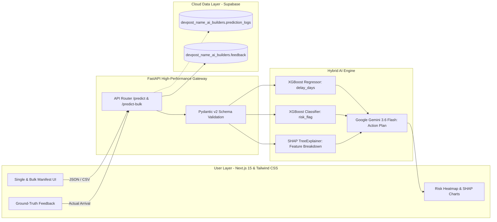

# ShipSight Intelligence

> **Predictable Logistics. Transparent Intelligence. Actionable Delivery.**  
> The Cross-Border Supply Chain Early-Warning System for the Real World.

---

# SLIDE 1: Title & Hook

### **ShipSight Intelligence**
## Stopping Multi-Million Dollar Supply Chain Disasters Before Port Departure

The End of Black-Box Freight Delays: Transparent, Auditable, and Actionable AI for Cross-Border Logistics.

* **Target Track:** Devpost AI Builders Hackathon
* **Live System:** Next.js 15 + FastAPI + Hybrid Dual-Engine XGBoost + TreeSHAP + Gemini 3.6 Flash + Supabase
* **Project Repository:** `github.com/Ivannov-arch/supply-chain-devpost`
* **Team:** Tatang Ivannov Kennedy & AI Builders Team

---

# SLIDE 2: Problem Statement & Storytelling

### Marcus Trusted the Shipping Schedule

Marcus runs a mid-sized healthcare supply firm importing temperature-sensitive antiretrovirals and medical equipment across borders. 

He booked an international shipment valued at **$120,000**. The freight tracking portal read *"In Transit - On Schedule"*. Marcus breathed a sigh of relief and promised delivery to regional clinics.

Then, the nightmare struck without warning:

```
[Port Congestion + Mismatched Incoterm + Dwell Delay] ──> 14-Day Unforeseen Hold-Up
```

* The temperature-sensitive medical cargo spoiled at the dock.
* He incurred a **$28,000 contract breach penalty**.
* His most lucrative healthcare client terminated their contract.

### Sounds devastating, doesn't it?

| The Global SME Reality | The Devastating Cost |
| :--- | :--- |
| **$1.6 Trillion** | Lost annually worldwide due to supply chain friction and unpredicted transit hold-ups. |
| **60%+ Shipments** | Suffer customs or carrier delays in cross-border corridors. |
| **90% of Operators** | Are SMEs who manage high-stakes freight relying solely on static Excel sheets, WhatsApp messages, and blind hope. |

---

# SLIDE 3: The Deep-Rooted Problem (Why Existing Tools Fail)

### Why Did Marcus Get Blind-Sided?

Marcus didn't fail because he was careless. He failed because existing logistics solutions are fundamentally broken for operators like him.

## 1. The Enterprise Paywall
Enterprise platforms (Project44, FourKites, Everstream) demand **$100k–$250k annual contracts** and **6 months of complex SAP/Oracle ERP integration**. Small and medium traders are completely priced out.

## 2. The Dangerous "Black-Box" AI Fallacy
Existing automated tools output a raw, opaque alert: *"Risk: High. Delay: 5 Days."*  
No logistics manager will reroute a $100k container or spend $15k on emergency air freight based on an unexplained number. **Opacity breeds inaction.**

## 3. Pure LLM Hallucinations vs. Classical ML Silence
* **Pure LLMs** cannot perform reliable numerical regression on tabular freight parameters—they invent delivery dates.
* **Classical ML** outputs cold statistics with **zero operational guidance** on what to do next.

---

# SLIDE 4: Solution Overview

### What If AI Could Forecast, Explain, and Prescribe?

**ShipSight Intelligence** is the first accessible, hybrid intelligence platform engineered specifically for cross-border exporters, importers, and forwarders.

```
┌─────────────────────────────────────────────────────────────────────────────┐
│                           The ShipSight Intelligence Triad                          │
├───────────────────────┬────────────────────────────┬────────────────────────┤
│     1. PREDICT        │         2. EXPLAIN         │      3. PRESCRIBE      │
│  (XGBoost Regressor   │    (Mathematical SHAP      │  (Google Gemini 3.6    │
│     & Classifier)     │       TreeExplainer)       │        Flash)          │
├───────────────────────┼────────────────────────────┼────────────────────────┤
│ Exact delay in days   │ 100% transparent feature   │ Dynamic, 3-step        │
│ & high/low risk flag  │ attribution percentage     │ tactical action plan   │
│ before goods leave.   │ driving the delay score.   │ to mitigate crisis.    │
└───────────────────────┴────────────────────────────┴────────────────────────┘
```

### The Core Promise:
* **Grounded in Real Data:** Trained on over 10,000 international shipments from the real-world **USAID SCMS Global Supply Chain Dataset**.
* **Zero Onboarding Friction:** Instant single-shipment risk checks and bulk shipping manifest uploads in seconds.

---

# SLIDE 5: Target Users

### Designed for the Overlooked 90% of Global Logistics

```
   [ SME Exporters / Importers ]       [ Independent Freight Brokers ]       [ Supply Chain Coordinators ]
   • Moving perishables, health        • Managing 20-50 clients              • Negotiating vendor Incoterms
     goods, & consumer tech            • Need proactive client alerts        • Eliminating detention/demurrage
```

## 1. Cross-Border SME Traders (Primary Persona)
* Need early warning 2–4 weeks before cargo arrival to adjust safety stock and avoid contractual breach penalties.

## 2. Mid-Tier Freight Forwarders & 3PLs
* Need instant risk auditing to advise client shipping modes (Air vs. Ocean Charter) and defend margins.

## 3. Procurement & Operations Leads
* Need transparency into vendor reliability, Incoterm risks (`EXW` vs. `DDU`), and port dwell vulnerabilities.

---

# SLIDE 6: Product Features

### From Manifest to Mitigation in Under 3 Seconds

| Feature | What It Delivers to the User |
| :--- | :--- |
| **1. Single Shipment Precision Radar** | Input destination, Incoterm, cargo category, weight, and freight cost. Receive instantaneous delay days forecast and risk badge. |
| **2. Bulk Manifest Scanner (`/predict-bulk`)** | Drag-and-drop a 200-row shipping manifest (CSV/Excel). View an aggregated high/low risk heatmap across all shipments in one view. |
| **3. Mathematical XAI Breakdown (SHAP)** | Live visual attribution chart showing top drivers (e.g., Freight Cost/Kg +38%, Incoterm +24%, Destination Port +18%). No more black box! |
| **4. Agentic Gemini Action Playbook** | Domain-tuned Gemini 3.6 Flash reads the ML metrics and generates 3 concise, highly executable mitigation steps per shipment. |
| **5. Closed-Loop Feedback Engine (`/feedback`)** | Shippers confirm actual delivery outcomes with one click. Data streams directly to Supabase to continuously retrain the AI models. |

---

# SLIDE 7: Technical Architecture

### Fast, Modular, and Enterprise-Grade Reliability



### Architectural Highlights:
* **Separation of Concerns:** Numerical predictions belong to XGBoost. Reasoning and tactical recommendations belong to Gemini. Zero hallucination.
* **Production-Ready Endpoints:** Fully typed Pydantic v2 schemas with sub-50ms inference latency.

---

# SLIDE 8: AI Technologies Used

### The Power of Hybrid Intelligence (Math + Reasoning)

We don't replace machine learning with an LLM; we fuse the best of quantitative ML with the best of Generative AI.

```
       [ 10,000+ Real USAID SCMS Records ]
                       │
       ┌───────────────┴───────────────┐
       ▼                               ▼
[ XGBoost Regressor ]          [ XGBoost Classifier ]
• MAE: 3.57 Days               • Accuracy: 91.6%
• Target: < 5.0 Days           • Sensitivity/Recall: 72.5%
• Status: PASSED               • Optimal Threshold: 0.51 (Tuned)
       │                               │
       └───────────────┬───────────────┘
                       ▼
             [ SHAP TreeExplainer ]
             • Exact mathematical feature impact
             • Zero black-box opacity
                       │
                       ▼
       [ Google Gemini 3.6 Flash Generative Agent ]
       • Prescriptive logistics reasoning
       • Sub-second generation of 3 actionable mitigation steps
```

### Why This Specific Stack Wins:
1. **XGBoost 2.1.1:** Proven gold standard for tabular cross-border logistics data with heterogeneous categorical features.
2. **SHAP 0.46.0:** Game-theoretic Shapley values provide mathematically provable local explanations for every single shipment.
3. **Google Gemini 3.6 Flash:** High-speed, context-aware generative model providing executive-level logistics consultation on demand.

---

# SLIDE 9: Impact and Value Proposition

### The New Standard in Supply Chain Intelligence

| Metric / Dimension | Traditional Guesswork | Enterprise Giants (Project44) | ShipSight Intelligence (Our Platform) |
| :--- | :--- | :--- | :--- |
| **Annual Cost** | Hidden ($28k+ per failure) | $100,000+ / year | **Freemium / Accessible SaaS** |
| **Setup & Onboarding** | None (Manual Excel) | 3 to 6 months integration | **Zero Setup (Instant Web & CSV)** |
| **Prediction Accuracy** | < 45% (Subjective gut) | Closed Proprietary | **91.6% Accuracy, 3.57-day MAE** |
| **Transparency** | None | Low (Black box) | **100% Auditable SHAP Breakdown** |
| **Actionable Advice** | None (Panic firefighting) | Telematics only | **Prescriptive Gemini Action Plans** |
| **Continuous Learning** | None (Repeats mistakes) | Static models | **Active Supabase Feedback Loop** |

### Immediate Financial Return (ROI):
* **Demurrage Savings:** Eliminating a 4-day port container hold saves up to **$1,600 per container** in dock storage penalties.
* **Contract Protection:** Proactive re-allocation of safety stock prevents SLA breach penalties and safeguards enterprise customer retention.

---

# SLIDE 10: Future Roadmap & Closing Vision

### What's Next for ShipSight Intelligence?

```
┌─────────────────┐     ┌─────────────────┐     ┌─────────────────┐     ┌─────────────────┐
│     PHASE 1     │ ──> │     PHASE 2     │ ──> │     PHASE 3     │ ──> │     PHASE 4     │
│  Hackathon MVP  │     │ Live Telematics │     │ Autonomous Agent│     │ Enterprise Mesh │
└─────────────────┘     └─────────────────┘     └─────────────────┘     └─────────────────┘
 • SCMS dual model       • Open-Meteo marine     • Multi-agent carrier   • Shopify & ERP
 • SHAP explainability     weather feeds           rerouting & quote       direct webhooks
 • Gemini Flash playbooks• AIS port congestion     negotiations          • Parametric micro-
 • Supabase feedback       satellite tracking    • Automated carrier       insurance hedge
                           (data.gov BTS)          re-booking              per shipment risk
```

---

### Transform Logistics Uncertainty into Your Competitive Advantage.

No more blind spots. No more black-box guesses. No more ruined customer trust.

* **Live Demo:** `ShipSight Intelligence-ai.vercel.app` *(or localhost:3000)*
* **Backend API:** `ShipSight Intelligence-api.onrender.com/docs`
* **GitHub Repository:** `github.com/Ivannov-arch/supply-chain-devpost`

> *"ShipSight Intelligence: Because knowing a delay is coming is good, but knowing why and how to fix it is everything."*